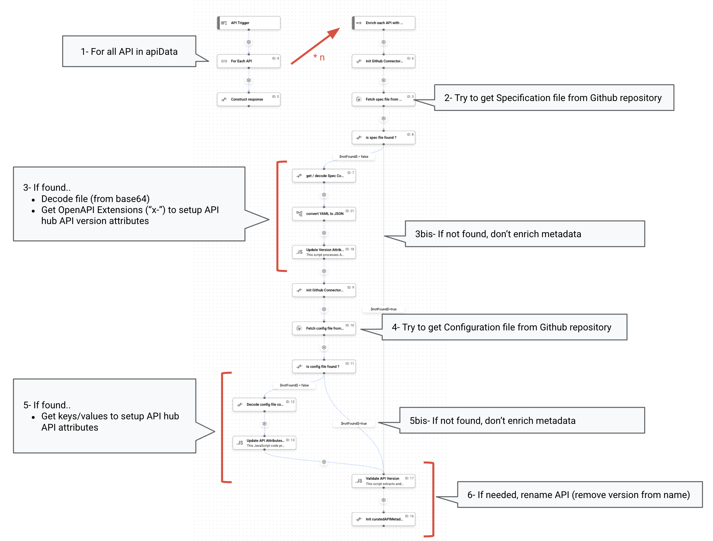

# Apigee Api Hub: Curation process using Github files

[](https://pypi.python.org/pypi/ansicolortags/) 

**This is not an official Google product.**<BR>This implementation is not an official Google product, nor is it part of an official Google product. Support is available on a best-effort basis via GitHub.


---
## Goal

This repository provides a concrete example of a custom **API Hub Curation** process, built using **Google Application Integration**. This process specifically ingests API metadata from a **GitHub repository**.

API Hub Curation involves transforming and enriching API metadata that has been ingested by Apigee API hub plugins. For a comprehensive overview, refer to the [Apigee API hub Curation documentation](https://cloud.google.com/apigee/docs/apihub/curations).

The curation logic implemented here performs the following steps for each ingested API:

* **Checks for API Specification File:** It verifies if an API specification file is available in the GitHub repository.
    * If **not available**, the API is ingested without any additional enrichment.
    * If **available**, it extracts:
        * **API Version Metadata** from the API specification file.
        * **API Metadata** from an API configuration file.
* **API Renaming:** The API's name is standardized by removing any versioning information (if present) to consolidate all versions under a single, consistent name.




## Prerequisites

To implement this sample, you'll need a GCP account with both Apigee API hub and Application Integration activated. If needed refer to Google Documentation [Provision API hub](https://cloud.google.com/apigee/docs/apihub/provision)and [Set up Application Integration](https://cloud.google.com/application-integration/docs/setup-application-integration).

You'll also need a GitHub account with privileges that allow setting up external access to your repositories, during Github Integraition Connector setup.


## Github setup

To begin, you'll need a **GitHub repository** to store your configuration and API specification files. If you haven't already, here are some essential GitHub tasks you'll need to complete, depending on your setup:

* **Create a GitHub account**: If you're new to GitHub, start by [creating an account](https://docs.github.com/en/get-started/start-your-journey/creating-an-account-on-github).

* **Create new repositories**: You'll need to [create a new repository](https://docs.github.com/en/repositories/creating-and-managing-repositories/creating-a-new-repository) to host your files.
  > If you want to test the Integration using sample default data, you can copy files **specfile.yaml** and **apiHub.cfg** in your repository.  

* **Create a GitHub App** to authenticate connexion from Integration Connexion. See Github documentation [create a GitHub App](https://docs.github.com/en/apps/creating-github-apps/about-creating-github-apps/about-creating-github-apps). 

  > ℹ️ One Github App. can allow access to one or many repositories : you can configure it in Github App. permissions.

  > ℹ️ the **Client ID** and **Client Secret** generated during this process are crucial for setting up your GitHub Integration Connection. You'll also need the **Callback URL** from your Integration Connection to finalize the GitHub App creation. For more details, refer to the [GitHub Integration Connection documentation](https://cloud.google.com/integration-connectors/docs/connectors/github/configure#configure-the-connector).


## Integration Connexion Setup

Application Integration leverages a **GitHub Integration Connection** to retrieve files from your GitHub repository. Therefore, your initial step is to create this connection by following the instructions provided in the [Configure the GitHub connector documentation](https://cloud.google.com/integration-connectors/docs/connectors/github/configure). Please also refer to the preceding note regarding GitHub App parameters (credentials and call back URL).

## Application Integration Setup

To upload, do the following steps:

1) Clone the repo 
```sh
https://github.com/g-lalevee/apihub-curation-github.git
```
2) In the Google Cloud console, go to the [Application Integration](https://console.cloud.google.com/integrations) page
4) In the navigation menu, click Integrations. The Integrations List page appears.
5) Select an existing integration or create a new integration by clicking Create integration.
If you are creating a new integration:
    - Enter a name `apiHubCurationGithub-v1` and description in the Create Integration dialog.
    - Select a Region for the integration from the list of supported regions.
    - Click Create.
    
    This opens the integration in the integration designer.
6) In the integration designer, click `Upload/download menu` and then select `Upload integration`.
7) In the file browser dialog, select `apiHubCurationGithub-v1.json`, and then click Open. A new version of the integration is created using the uploaded file.
8) In the variable panel, update default values for config variables
    - `CONFIG_githubConnectionName`: the name of the Integration Connection created during step **Application Integration Setup**.
    - `CONFIG_githubRepoName`: the name of the Github repository used to store API specification files and configuration files.
    - `CONFIG_githubRepoOwnerName`: the name of the Github owner name of the repository.
9) In the integration designer, click Deploy.


## Apigee API hub Setup

Now you'll create a new custom Curation within Apigee API Hub and then associate it with an ingestion plugin.

First, let's create the custom Curation:

1.  In the Google Cloud console, navigate to the [Apigee API Hub page](https://console.cloud.google.com/apigee/api-hub/get-started).
2.  In the left navigation menu, click **Settings**.
3.  Select the **Curations** sub-menu, then click **Setup a new Curation**.
4.  Enter a **Curation name** and, from the dropdown list, select your Integration (**apiHubCurationGithub-v1**) and the **api_trigger/curation** trigger.
5.  Click **Create curation**.

If you need more detailed instructions, you can refer to the [API Hub documentation on creating custom curations](https://cloud.google.com/apigee/docs/apihub/manage-curations#create-custom-curation).

Next, you need to associate this new curation with your ingestion plugin. Currently, API Hub doesn't support editing existing plugin instances. This means if you want to change a plugin instance's configuration (like its curation logic), you'll need to delete the existing one and create a new one. For further information, see the [API Hub documentation on managing plugin instances](https://cloud.google.com/apigee/docs/apihub/manage-plugin-instances).

To associate your new curation:

1.  Select the **Plugin** sub-menu, then click **Setup a new Plugin**.
2.  Delete the existing plugin instance.
3.  Create a new plugin instance, providing the following:
    * **Display name**: A name for your plugin instance.
    * **Sync frequency**: How often the plugin instance should sync with its data source (default is Hourly).
    * **Curation**: Select the curation you created in the steps above.


---
## Testing Your Integration

To effectively test this integration with the provided sample files (**ApiHub.cfg** and **cl-AudienceAnalyse-v1.yaml**), you'll need to configure specific API Hub attributes. These attributes are referenced by the integration's default `apiData` values.

Here's a breakdown of the attributes and their corresponding values:

* **`ApiHub.cfg`** contains:

    ```sh
    api_targetUser="internal"
    api_team="testing"
    api_businessUnit="none"
    api_maturityLevel="level-1"
    api_apiStyle="rest"
    ```

* **`cl-AudienceAnalyse-v1.yaml`** contains:

    ```yaml
    openapi: 3.0.0
    info:
      title: Contextual Analyzis API
      description:...
        . . .
      x-data-classification: publicaopenadata

    x-lifecycle: develop
    ```

You'll need to configure the following **API Hub system attributes** with their corresponding IDs and values:

| System Attributes | Resource | Value          | ID               | Description            |
| :---------------- | :------- | :------------- | :--------------- | :--------------------- |
| Target Users      | API      | internal       |                  | Internal target user   |
| Team              | API      | Testing        | testing          | Apigee Testing Team    |
| Business Unit     | API      | None           | none             | None                   |
| Maturity Level    | API      | Level 1        | level 1          | Resource               |
| API Style         | API      | REST           |                  | REST                   |
| Lifecycle         | Version  | Develop        | develop          | Development            |
| Compliance        | Version  | Public\_Open\_Data | publicaopenadata | Publicly available data |

For detailed instructions on how to update API Hub system attributes via the interface or API, refer to the [API Hub System Attributes documentation](https://cloud.google.com/apigee/docs/apihub/manage-attributes#system-attributes).

---

### Unit Test from Application Integration

You can perform a quick unit test directly within Application Integration:

1.  Open the `apiHubCurationGithub-v1` Integration in the Application Integration designer.
2.  Ensure the Integration is deployed.
3.  Click the **Test** button and validate the default values. This will run the integration and display the execution results in the "Test Integration" dialog.

---

### API Hub Plugin Manual Test

> ⚠️ **Important Note on Running Curation:**
>
> When you run the Curation process from your API Hub, it will apply the curation logic to **ALL** your APIs, with slightly different behaviors depending on whether an API has a corresponding specification file in your GitHub repository:
>
> * **Renaming Only:** If an API **does not** have a corresponding API specification file in the GitHub repository, only the **renaming part** of the process will be applied.
> * **All Steps Applied:** If an API **does** have a corresponding API specification file in the GitHub repository, **all defined curation steps** (including enrichment and renaming) will be applied.


To see the curation in action within API Hub:

1.  In the Google Cloud console, navigate to the API Hub interface.
2.  In the left navigation menu, click **Settings**.
3.  Select the **Plugins** sub-menu, then click the "3 dots" menu to the right of your configured plugin.
4.  Select **Run**.
5.  After a few minutes, click **APIs** in the left navigation menu.
6.  Validate how your APIs have been imported and enriched based on the curation logic.
    
    